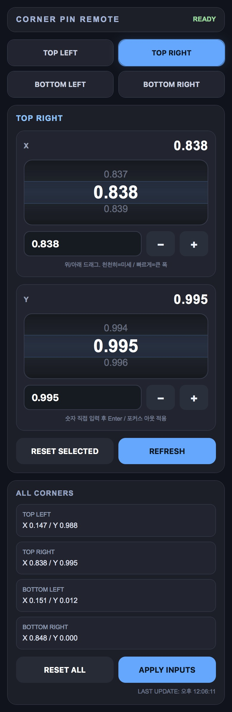

# TD Corner Pin Remote

## 스크린샷
 
### 핸드폰 UI

 

TouchDesigner 프로젝션 맵핑용 코너핀 원격 제어.  
보조 모니터 없이 **핸드폰 브라우저**로 코너 4개를 실시간 조정합니다.

## 요구사항

- TouchDesigner 2023.x 이상 (2025.32460 확인)
- PC와 핸드폰이 같은 Wi-Fi

## 설치

1. `setup_cornerpin.py` 내용 전체 복사
2. TouchDesigner → `Alt+G` (Textport 열기)
3. 붙여넣기 → `Enter`
4. 아래 3개 노드가 `/project1`에 자동 생성됩니다:

| 노드 | 타입 | 역할 |
|------|------|------|
| `cornerpin1` | Corner Pin TOP | 영상 왜곡 처리 |
| `cornerpin_server1` | Web Server DAT | HTTP 서버 (port 9981) |
| `cornerpin_callbacks1` | Text DAT | HTML UI + API 핸들러 |

## 연결

```
[콘텐츠 TOP] → cornerpin1 → [Out TOP / Window COMP]
```

Textport에서 기존 소스에 연결:
```python
src = op('/project1/your_source_top')
op('/project1/cornerpin1').inputConnectors[0].connect(src)
```

## 접속

```
http://[PC_IP]:9981
```

PC IP 확인 (cmd):
```
ipconfig
```
IPv4 주소 사용 (예: `192.168.10.100`)

## UI 조작

| 조작 | 동작 |
|------|------|
| 위/아래 드래그 | 값 변경 (속도에 따라 step 자동 조절) |
| `+` / `-` 버튼 | 0.001 단위 미세 조정 |
| 숫자 직접 입력 | Enter 또는 포커스 아웃으로 적용 |
| RESET SELECTED | 현재 코너 기본값 복원 |
| RESET ALL | 전체 코너 기본값 복원 |
| REFRESH | TD에서 현재 값 다시 읽기 |

## 설정 변경

`setup_cornerpin.py` 상단:

```python
TARGET = '/project1'   # 노드 생성 위치
PORT   = 9981          # 포트 (기존 webserver와 충돌 시 변경)
CP_OP  = 'cornerpin1' # Corner Pin TOP 이름
```

## 문제 해결

**접속 안 될 때**
- Windows 방화벽 → TouchDesigner 허용 확인
- `webserver1` 등 다른 웹서버와 포트 충돌 확인
- Textport에서 `op('/project1/cornerpin_server1').par.active = 1` 실행

**파라미터 에러 날 때**
- TD 버전마다 Corner Pin TOP 파라미터 이름이 다를 수 있음
- Textport에서 확인: `[print(p.name) for p in op('/project1/cornerpin1').pars()]`

## 라이선스

MIT
